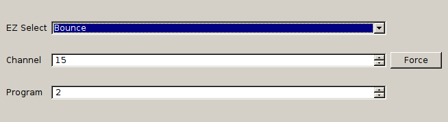

ChannelChooser
==============

Ub3r simple PyQt gui to control a Silicon Image's HDHomeRun box in a non-technical way.

Requirements
------------

+ A [HDHomeRun](http://www.silicondust.com/ "HDHomeRun")
+ A working copy / install of [libhdhomerun](http://www.silicondust.com/support/downloads/linux/ "libhdhomerun")
+ PyQt
+ vlc

Prep Work - Creating ~/.channels.ini
------------------------------------

Unfortunately, you will need to do some legwork here. The first thing you will need to do is collect a list of channels, programs, and the network.  You will need to create ~/.channels.ini in a format like thus:

``` ini
[Network Name]	
channel=7
program=3
```

There are websites that can help with this, but overall, its just better to do it manually.

Installation
------------

1. Create (or modify my) ~/.channels.ini
1. Run ChannelChooser
1. Profit!

Screenshot
----------

