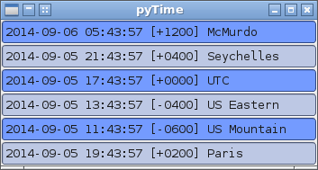
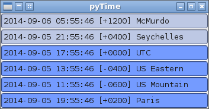

pyTime
======

A desktop clock based off wxpython and python 2.x. Displays the time from
various configurable timezones. Comes in really handy when on world-wide 
travel - particularly useful on scientific programs where you need to know
UTC in addition to whenever lunch is, when the significant other gets off 
work, etc...

Requirements
============

+ python 2.x
+ wxpython (something recent)

Screenie
========






Configuration ini file
======================

The configuration file is a simple .ini file named 'pyTime.cfg'.  The sample is posted below

``` ini
[pyTime]
#format is passed to strftime() to format a date string.
format: %Y-%m-%d %H:%M:%S [%z]

# Any string that starts with the word 'offset' will be appended and displayed
# The string format is:
# <Unix TZ: eg US/Eastern>:<Text for offset>:[optional format]
# if the optional format is not give, the above defined will be used the 
# offsets are sorted in ascii-betical order (alphebetical with order on caps and numbers)

#offset0: UTC              : UTC                   : %Y%m%d%H%M     %S
offset3: UTC              : UTC
offset1: Pacific/Auckland : McMurdo
offset2: Indian/Mahe      : Seychelles
offset4: US/Eastern       : US Eastern
offset5: US/Mountain      : US Mountain
offset6: Europe/Paris     : Paris


# colorSchema determins the usage of the following variables:
#     backgroundToneA
#     backgroundToneB
# If colorSchema is not set; or set to something invalid; or set to 
# 'alternating' the above variables will be used to paint every other offset
# cell color (eg.  offset 1,3,5,... will be background Tone A 
# and offset 2,4,6,... will use background Tone B
# If colorSchea is set to 'diurnal', Tone A will be used for  daylight hours and
# Tone B will be used for night hours
colorSchema: alternating


#the Tone colors are given in HTML 6 character hex format: eg FFFFFF for white,
#FF0000 for red, 00FF00 for blue, 0000FF for green, and 000000 for black.

backgroundToneA: 749bff
backgroundToneB: bdc8e4
```
